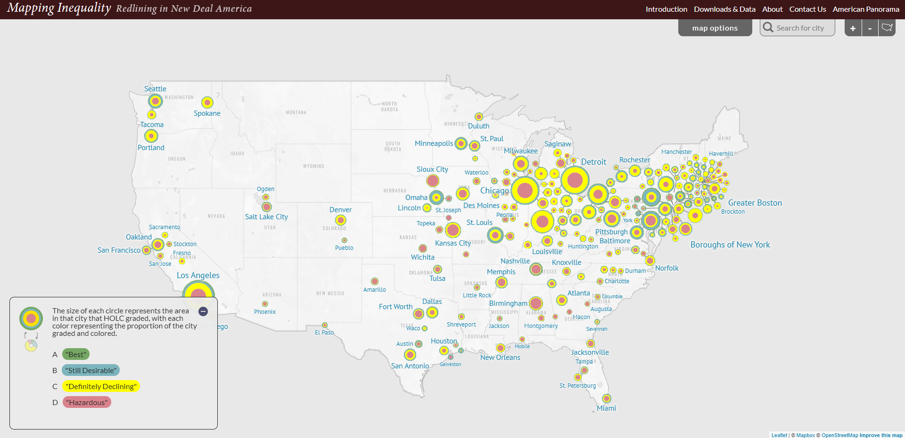
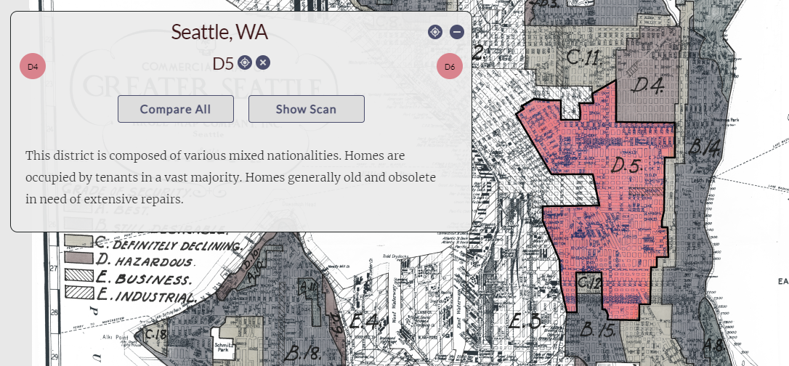
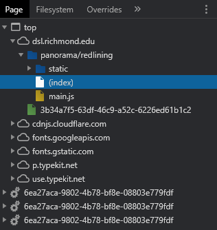
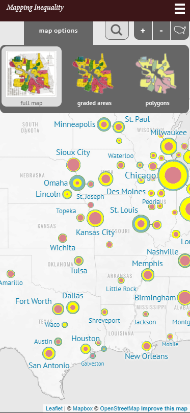
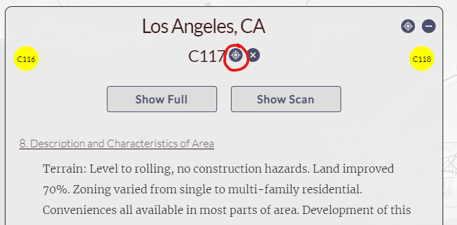
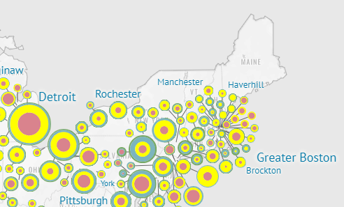
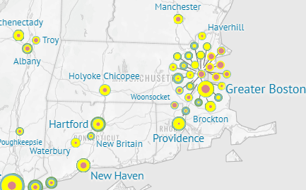

# Mapping Inequality in the Digital Age
Emily Siangkam

GEOG 458

[*Mapping Inequality* site](https://dsl.richmond.edu/panorama/redlining/#loc=5/39.1/-94.58)

## Introduction
#### *Background*
In 1933, the United States federal government created the Home Owners' Loan Corporation (HOLC) as part of the New Deal to expand home buying opportunities, refinance home mortgages, and extend relief to homeowners (Gross, 2017). As such, from 1935 to 1940, the corporation used data and evaluations created by local real estate professionals to assign grades to residential neighborhoods based on their "mortgage security" (Mapping Inequalities, n.d.). Neighborhoods identified as having minimal risks for lenders were colored in green and given the grade "A", while the "riskiest" areas were deemed "hazardous", colored in red, and given the lowest grade, "D" (Mapping Inequalities, n.d.). This practice became known as redlining and primarily served to provide housing to white, middle- and lower-middle-class families (Gross, 2017). As a result, African Americans and other marginalized communities were pushed into urban housing projects as lenders refused to make loans. This segregationist practice has lasting impacts on the United States today, as showcased in the *Mapping Inequality* project.

#### *Project Goals*
*Mapping Inequality* was created with the goal of providing the public with access to what its creators consider one of the country's most important archives. While the HOLC and Federal Home Loan Bank Board created millions of jobs and helped millions of Americans keep their homes, it also expanded practices of racial and class segregation. Through the use of a proportional symbol map as a smart dashboard, they hope to "offer a window into the New Deal era housing policies", and provide a new view and/or language to describe the relationship between wealth and poverty in the United States (Mapping Inequality, n.d.).

For this reason, one of the major functions of this project is the ability to click on different cities to view pop-ups. When zoomed in to the cities, the user can see the archived "commercial" map images overlayed on the basemap with the color grades given on corresponding areas. Each area has a pop-up that typically displays demographics, area descriptions, and scans of the original documents of area notes. The map also includes legends for each city explaining the colors of the circles (grades) and the size (areas in that city that HOLC graded). In effect, this increases the ability for the American public audience to view and criticize pieces of history.

*Example of a pop-up of area D5 in Seattle*

#### *Authors and Affiliations*
*Mapping Inequality* was created through the collaboration of three teams at 4 universities: Robert K. Nelson led the Digital Scholarship Lab team at University of Richmond, while Nathaniel Ayers co-designed the map and Justin Madron managed the data; Professor LaDale Winling led the team of Virginia Tech students conducting research at the National Archives; Professor Richard Marciano led the team of students from University of Maryland; and Professor N. D. B. Connolly at Johns Hopkins University contributed his expertise in the history of race and urban America for the textual elements. Through the help of a multitude of students, groups, and other individuals, the components of *Mapping Ineqality* came together.

#### *Data Sources*
Although there is no collection date, the authors credit the [National Archives](https://www.archives.gov/) for the majority of HOLC maps, which are public domain. Their dates range from 1935 to 1940. The basemap tiles were orovided by [MapBox](https://www.mapbox.com/), and the [rest of the data (spatial, textual, etc.)](https://dsl.richmond.edu/panorama/redlining/#loc=11/42.187/-89.09&city=rockford-il&area=D6&text=downloads&adviewer=sidebar) was put together by the teams previously mentioned.

## Systematic Architecture
The functionality of this dashboard was evaluated through the Google Chrome web client. The University of Richmond uses Apache web servers, one of the most popular servers due to its open source code and free installation (Granados, 2019). The map itself utilizes a [MapBox](https://www.mapbox.com/) basemap, a simplistic gray monochrome that blends the states in the background. It was constructed using [Leaflet](https://leafletjs.com/), an open-source JavaScript library for mobile-friendly interactive maps.

By using Leaflet, the authors could add their major function of pop-ups through the Ajax plugin. This allows them to load a GeoJSON file and improve interactivity through the pop-ups that tell this map's story. There are also CSS stylesheets from [Google APIs](https://developers.google.com/apis-explorer) and [Adobe Typekit](https://fonts.adobe.com/home), which both allow for use of varied fonts, such as Merriweather, Lato, and PT Sans, throughout the project. The [spatial data](https://dsl.richmond.edu/panorama/redlining/#loc=5/45.011/-112.764&text=downloads) from this project was developed by the authors themselves, based on the scans from National Archives.

*Sources, as indicated by Google Chrome DevTools*

The webmap consists of tiles that only load when the user zooms in or out of the map, therefore saving time loading content on the page. The tiles are thus hosted on Amazon Simple Storage Service (S3) as offered by Amazon Web Service. When a user chooses to look at a certain part of the map, the folder for these tiles will appear in the source code. Although I attempted to do some digging, I could not figure out the file server directly. I assume that when a client requests data from a certain part of the map, the tiles hosted by S3 are sent to Apache and loaded on the client.

## UI/UX and Web Mapping design
The overall map has a relatively simple, yet cohesive, design. Considering users typically read information in a “Z” pattern on pages, the important map elements correspond with these theme – title in the top left corner, tabs and user control elements in the top right corner, the legend in the bottom left corner, and attributions on the bottom right corner. The legend itself is large enough to draw the attention of the user and explains the sizes and colors of the symbols on the map that directly correspond to the shaded areas on city commercial maps. Hence, users can more quickly and easily understand how to read the map.

As previously mentioned, the basemap is a simple gray monochome created using [MapBox](https://www.mapbox.com/), which matches well with the purpose of the map, as it does not distract the user with unnecessary information. The thematic layer consists of all cities that had been evaluated by the HOLC for lender risks. Again, these were inserted using the Ajax Leaflet plugin, which allows insertion of GeoJSON files. The cities are represented as proportional symbols, with colors indicating the grade given by HOLC.

The interactive features in the top right corner provide the user with a multitude of choices: map options for displaying full maps from archived scans or displaying polygons alone, searching for cities, zooming in and out of the map, and resetting the map to the original zoom level. Once a user clicks on a circle, colored polygons are displayed regardless of the map option, and a new pop-up appears that displays the archived notes by the HOLC. These include areas by grade, demographics, area descriptions, and the original scan that provided this information.

Surprisingly enough, the map does support responsive design - even as a user navigates to the page via a mobile device, such as an iPhone, iPad, or Galaxy, the page offers the same functionality on a smaller scale. One important note, however, is that the legend does not automatically pop up while on mobile. Below is an example of the page on an iPhone X, where the user likely would not immediately understand the purpose of the site.

*Screenshot of Mapping Inequality on an iPhone X*

## Pros and Cons
#### *Pros*
- *Mapping Inequality* makes archived data accessible to the public, especially so by transcribing the information from the scanned documents of commercial maps into the pop-ups on the webmap. It can be particularly difficult to read small text or words on images, and typing the words out can remove this barrier.
- The different pages available to the user in addition to the actual map provide appropriate context for users who may not know about the history of redlining in the United States. Here, the authors have included "Introduction", "Downloads & Data", "About", "Contact Us", and "American Panorama" tabs that tell the user the map's story, where they can download or look at the data on one page, read about and contact the authors, and view similar map projects.
- The names of the cities are large enough for a person to easily identify most places they may want to look at without having to zoom in to the map.

#### *Cons*
- The initial idea behind the project is not apparent right away. Although the legend is in such a huge size when the map first loads, it takes some clicking through the map to really understand what is happening.
- Some of the buttons do not have tooltips/mouseover text that would indicate to the user what they do. Obviously, the "X" and minimize tool may be commonly understood, but the "Zoom to" button is not as clear. Upon further use, the user can figure out that clicking on this button on the pop-up would zoom to the appropriate area on the map.

*Screenshot of pop-up for Los Angeles, circling the zoom button*

- The cities overlap in some places, especially if there are a large number of cities in one area. When this occurs, it becomes especially difficult to identify smaller cities that may be hiding underneath big ones, or to pick out the names of these places. The "arms" on the markers connecting them to places help a bit, but it can be confusing, since many markers are not located where they actually are on the map.

*Zoom out of Boston area*

*Zoom in of Boston area*

- The map is so simple that it is somewhat dull. The font of the title seems to follow and "old-fashioned" theme reminiscent of the 1700s, as though it were written for the Declaration of Independence. Although the map colors closely relate to those used on those on the scanned commercial maps, bright and more appealing could have been used. Unless the point was to look like an old site, the page itself could use further design work. Nonetheless, it works for its purpose.

## Relevance to Digital Geographies
*Mapping Inequality* is a great project that provides the public with access to American history that might not be available to people otherwise. This issue is reflective of the digital divide, in that those who have the time and privilege to access something like the National Archives, whereas others may not even know where to look in the first place and eventually forget such important events occurred. For instance, in Sarah Bond's "How Is Digital Mapping Changing The Way We Visualize Racism and Segregation?", they accentuate the power that digital mapping and database construction have in allowing us to "reconstruct, preserve, and visualize vestiges of the past, but academics engaged in this work are often dependent on the public for aid" (2017).

Building on this idea, making these documents available to the public through this project "puts data back into context", an idea brought up by Catherine D'Ignazio. In this instance, the National Archives has the commercial map documents freely available to the public, but it can extensive amount of time to get oriented with the data and understand what it is telling you (D'Ignazio, 2017). The authors of *Mapping Inequality* remove all this work for the public, allowing the story of redlining and inequality told as it should be. Without the context of the maps and the notes the HOLC made while assessing these areas, this likely would not be as powerful of a story.

Both this project and Bond (2017) acknowledge the African American experience and how digital mapping can help the public understand the detrimental effects of slavery on the country. I would even argue that this is an example of resistance. In fact, Bond (2017) even notes that black people and other people of color have turned to mapping for years to visualize racism. As such, mapping is a powerful tool for marginalized populations to fight back against the oppressions they have faced for hundreds of years.

## References
Bond, S. (2017). *How Is Digital Mapping Changing The Way We Visualize Racism and Segregation?*. Forbes. https://www.forbes.com/sites/drsarahbond/2017/10/20/how-is-digital-mapping-changing-the-way-we-visualize-racism-and-segregation/?sh=2bb5c13d33fa

D'Ignazio, C. (2019). *Putting data back into context: Why context is hard.* Datajournalism.com. https://datajournalism.com/read/longreads/putting-data-back-into-context

Granados, J. (2019). *5 of the Best Web Servers Available*. Sados. https://sados.com/blog/5-best-web-servers/

Gross, T. (2017). *A Forgotten History of How the US Government Segregated America.* NPR. https://www.npr.org/2017/05/03/526655831/a-forgotten-history-of-how-the-u-s-government-segregated-america
